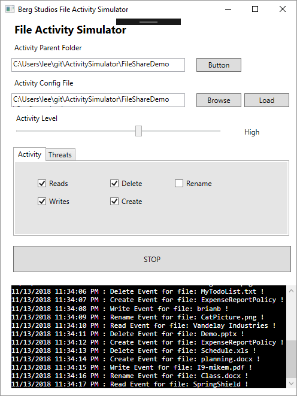
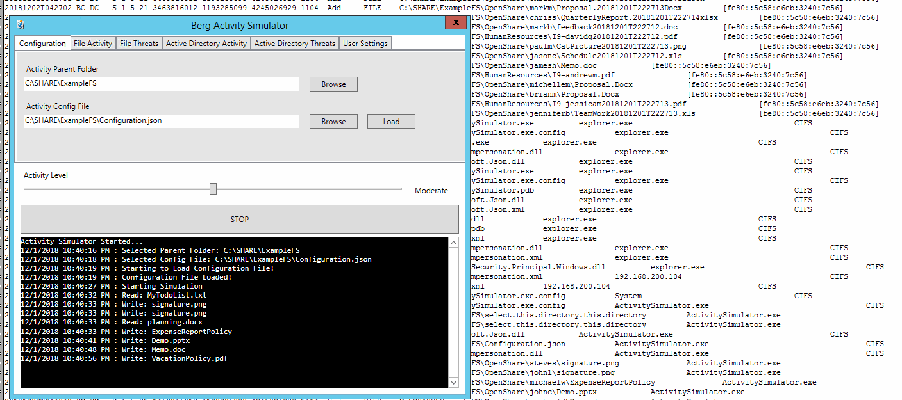

Activity Simulator
==================
A simple utility to generate real File and Active Directory activity in lab environments for the purposes of monitoring changes and detecting "threats".

## Usage
1. Configure a JSON Configuration File for the activity simulator - example provided in the "FileShareDemo" folder!
1. Pick a Parent Directory (Sample Directory Included) - Ensure you have no important data in this directory - example provided in the "FileShareDemo" folder!
2. Specify a JSON File for Configuration - From Step 1.
3. Select Activity Types and Threatening Behaviour to Simulate
4. Specify Domain Users to Impersonate the activity as on the "User Settings" Tab
5. Set frequency of events with the "Activty Level" slider
5. Click Start
6. Utlity will then begin the activity specifced by your selections. with  make chagnes to files / folders specified in step 1 and 2 so be careful!
7. This will just run forever until you stop it!

## Requires
+ .NET Framework 4.7.2
+ For domain user impersonation - you will likely need to run the application from a domain joined machine.

## Todo 
+ Clean up sloppy WPF
+ Implement "Threats" - "Ransomware Simulation / Risky Behaviour
+ Implement Active Directory Activity
+ Make the Account management more robust

